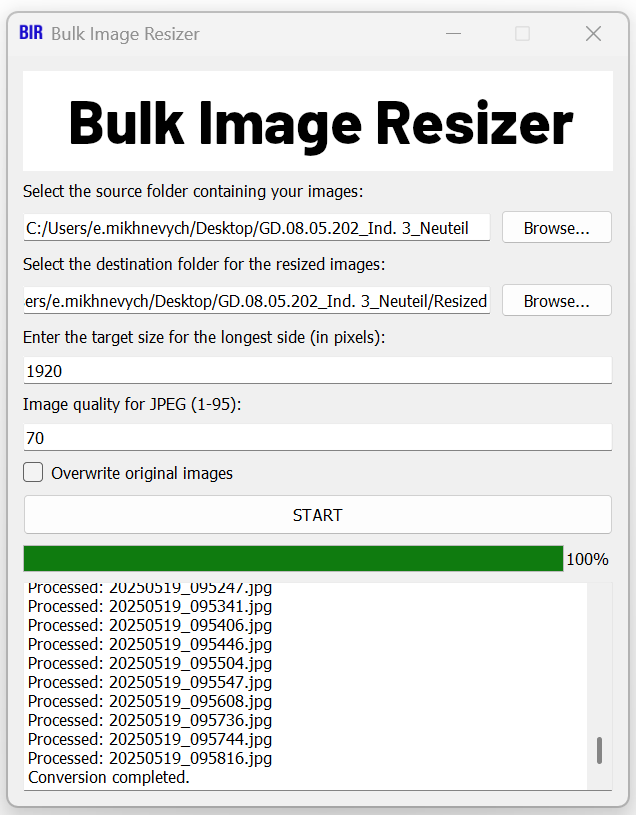

# Bulk Image Resizer

A simple yet powerful desktop application for batch resizing of JPG, JPEG, and PNG images. Built with Python and PyQt5, this tool provides a clean graphical user interface to quickly process entire folders of images.

---

---

## Features

* **Batch Processing**: Resize all images in a selected folder at once.
* **Proportional Resizing**: Images are resized based on their longest side, preserving the aspect ratio.
* **JPEG Quality Control**: Specify the compression quality (1-95) for JPEG files to balance size and quality.
* **Overwrite Option**: Choose to save resized images in a new folder or overwrite the originals to save space.
* **Metadata Stripping**: Automatically removes metadata (like EXIF data) from images to reduce file size and protect privacy.
* **Simple GUI**: An intuitive and easy-to-use interface, perfect for users of all skill levels.
* **Cross-Platform**: Works on Windows, macOS, and Linux.

## How to Use

1.  **Source Folder**: Click "Browse..." to select the folder containing the images you want to resize.
2.  **Destination Folder**: Click "Browse..." to select a folder where the resized images will be saved. (This is disabled if you choose to overwrite).
3.  **Target Size**: Enter the desired length for the longest side of the images in pixels (e.g., `1920`).
4.  **JPEG Quality**: Set the quality for saved JPEG files (e.g., `80`). Higher values mean better quality and larger file sizes.
5.  **Overwrite Originals**: Check this box if you want to replace the original images with the resized ones. **Use with caution!**
6.  **START**: Click the START button to begin the process. The progress bar will show the status, and the log window will display details for each file.

## Setup and Installation

To run this application from the source code, you'll need Python 3 and a few packages.

1.  **Clone the repository:**
    ```bash
    git clone [https://github.com/eugenmik/bulk_image_resizer.git](https://github.com/eugenmik/bulk_image_resizer.git)
    cd YOUR_REPOSITORY
    ```

2.  **Create and activate a virtual environment:**
    ```bash
    # For Windows
    python -m venv venv
    venv\Scripts\activate

    # For macOS/Linux
    python -m venv venv
    source venv/bin/activate
    ```

3.  **Install the dependencies:**
    ```bash
    pip install -r requirements.txt
    ```

4.  **Run the application:**
    ```bash
    python main.py
    ```

## Creating an Executable (`.exe`)

You can compile this application into a single standalone executable file using **PyInstaller**. This allows you to run it on any Windows computer without needing to install Python or any libraries.

1.  **Install PyInstaller:**
    ```bash
    pip install pyinstaller
    ```

2.  **Run the PyInstaller command:**
    Open your terminal or command prompt in the project's root directory and run the following command. This command bundles the script, the icon, and the header image into one file.

    ```bash
    pyinstaller --onefile --windowed --name "Bulk Image Resizer" --icon="icon.ico" --add-data="header.png;." --add-data="icon.ico;." main.py
    ```

    **Command Breakdown:**
    * `--onefile`: Creates a single executable file.
    * `--windowed`: Prevents a console window from appearing when the application runs.
    * `--name "Bulk Image Resizer"`: Sets the name of your `.exe` file.
    * `--icon="icon.ico"`: Sets the application icon.
    * `--add-data="asset;."`: Bundles an asset file (like `header.png`) into the executable. The `;.` part tells PyInstaller to place it in the root directory of the temporary bundle. **Note:** On macOS or Linux, use a colon (`:`) instead of a semicolon (`;`).

3.  **Find your executable:**
    Once the process is complete, you will find your `Bulk Image Resizer.exe` inside a new `dist` folder.

## Customization

You can easily customize the look of the application:
* **Icon**: Replace `icon.ico` with your own `.ico` file (of the same name) to change the application's icon.
* **Header**: Replace `header.png` with your own image to change the banner at the top of the application. A recommended size is around **600x100 pixels**.
